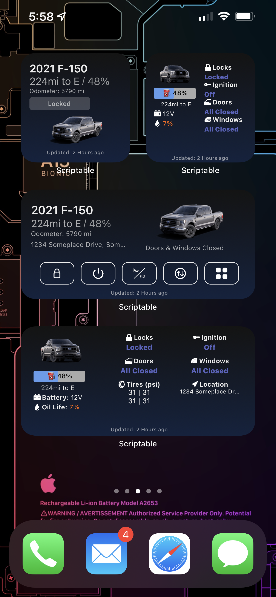
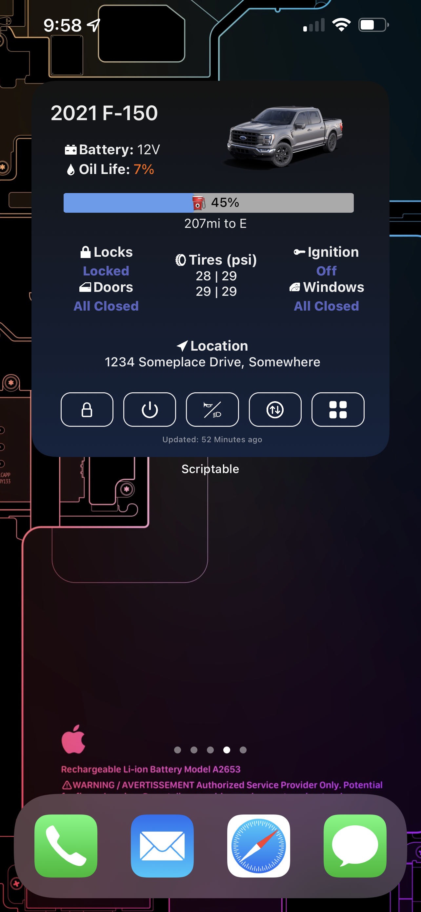
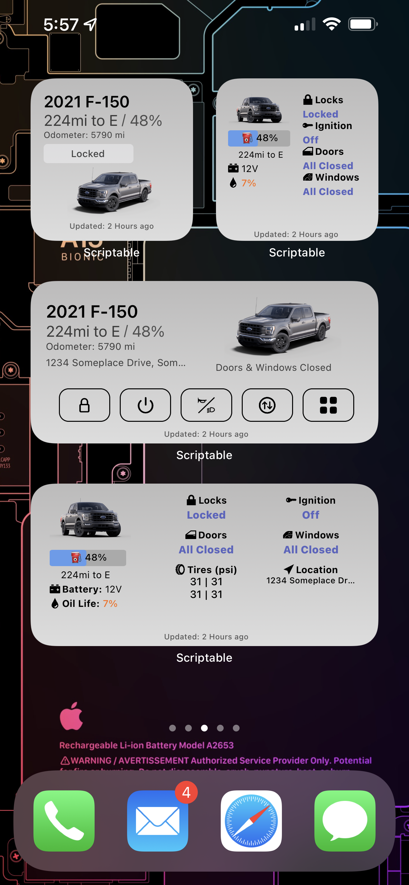
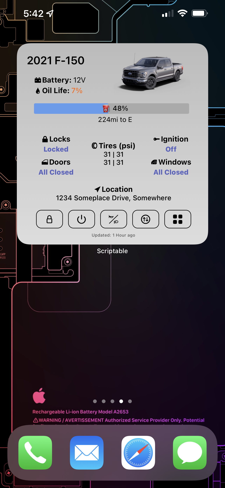

# FordPass widget for iOS Scriptable

   
   
 
  
## Intro

This widget was based off the work of  by David Schablowsky.
It has been completely rewritten to add a whole new design, support infinitly more features, and will be much easier to maintain and improve over time.
This version no longer requires you to edit the script file to configure login information and preferences.
The widget now fetches all information required about your ford vehicle and displays them in a simple interactive widget.
The widget has been tested on many many ford models, and should work on any vehicle that's supported in the FordPass mobile app.

## Requirements

- iOS 14+
- [Scriptable App](https://scriptable.app/) (free)
- [FordPass account](https://sso.ci.ford.com/authsvc/mtfim/sps/authsvc?PolicyId=urn:ibm:security:authentication:asf:basicldapuser&Target=https%3A%2F%2Fsso.ci.ford.com%2Foidc%2Fendpoint%2Fdefault%2Fauthorize%3FqsId%3D1f0281db-c684-454a-8d31-0c0f297cc9ed%26client_id%3D880cf418-6345-4e3b-81cd-7b623309b571&identity_source_id=75d08ad1-510f-468a-b69b-5ebc34f773e3#appID=CCCA9FB8-B941-46AD-A89F-F9D9D699DD68&propertySpecificContentKey=brand_ford&originURL=https%3A%2F%2Fwww.ford.com%2F&lang=en_us&fsURL=https%3A%2F%2Fapi.mps.ford.com) (has to be working with FordPass app, and NOT MyFord Mobile)

## Features

- Will automatically fetch data from server (default is every 3-5 minutes)
- Tapping on the Vehicle location in the widget will open Apple Maps (or Google Maps) pin the position of your vehicle.
- Tapping anywhere in the widget will open the scriptable app and provide you with a dashboard of quick controls and info supported by your vehicles capabilities.
- Automatically pulls in the following info about you and your vehicle:
  - Vehicles actual image
  - Distance and Pressure units defined in the FordPass app.

- New widgets create quick buttons to perform quick actions on your vehicle (This will open the scriptable app because executing code is not allowed on iOS widgets).

- Debug Menu to view advanced information about your vehicle data:
  - View the Hidden OTA data embedded in Ford.com vehicle dashboard.
  - View all data pulled into the widget using various ford endpoints.
  
## Screenshots
 

## Known Issues & Limitations

- The widget offers limited controls for electric vehicles at the moment (I need to get the commands from the FordPass app mapped out.)
- Sometimes the fuel and oil data will be missing or incorrect. This is due to the fact that the fuel and oil data is not always available in the Fordpass API when the vehicle is off.

## Community Help

 Discord Link: <https://discord.gg/VPw3zw9v>

## Todo

- Get small, large, and extra large layouts working.
- Widget code updater mechanism (I don't have a way to do this yet)

## Installation

Please visit this site for easy install process

- https://tonesto7.github.io/fordpass-scriptable

### Install Videos

- https://tonesto7.github.io/fordpass-scriptable/videos/install_demo.mp4

### Setup Videos

- https://tonesto7.github.io/fordpass-scriptable/videos/setup_demo.mp4

## Troubleshooting and Debugging

The easiest way to edit the code and see the results in realtime is to use iCloud on your computer. On windows it requires installing the [iCloud Drive](https://www.icloud.com/drive/).

If you browse to the iCloud Drive folder look for the Scriptable folder and you will see all the scripts you have in the app.  Just edit the Fordpass Widget.js file and save it and within a few seconds it will be updated in the Scriptable app which you will need to tap the 3 dots on the widget in the app.  You have to exit the editor view in the scripable app after each external code change.
Then just hit the play symbol to run the code in the app.

## Credits

Thanks to [dschablowsky](https://github.com/dschablowsky/FordPassWidget) for his work on the original widget, [d4v3y0rk](https://github.com/d4v3y0rk) for finding out the information about the ford api. Additional thanks to [marco79cgn](https://github.com/marco79cgn) and [Tobias Battenberg](https://github.com/mountbatt) for your widgets. They inspired me to create my own widget!

## Disclaimer

I have created this widget in my freetime. I do NOT work for Ford nor do I get anything for creating this widget. The api used can be changed at any moment by Ford. Do not share this widget code with your login data embedded in it. I am NOT liable for any kind of damage (special, direct, indirect, consequential or whatsoever) resulting from the use of this widget/script. Anybody who is in possesion of your data can control your car.
