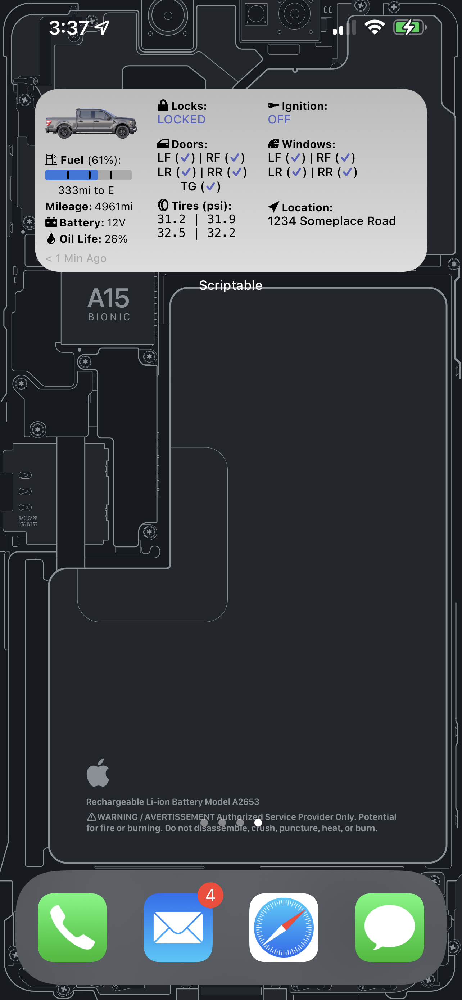
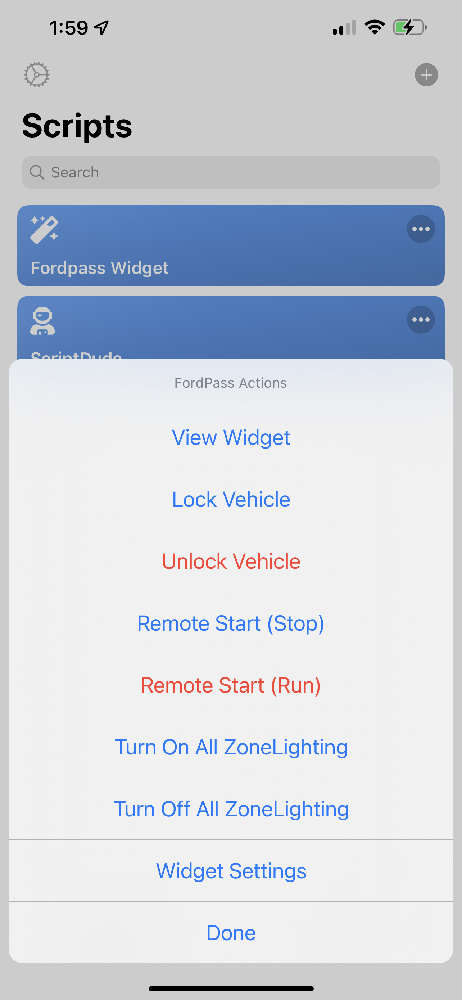
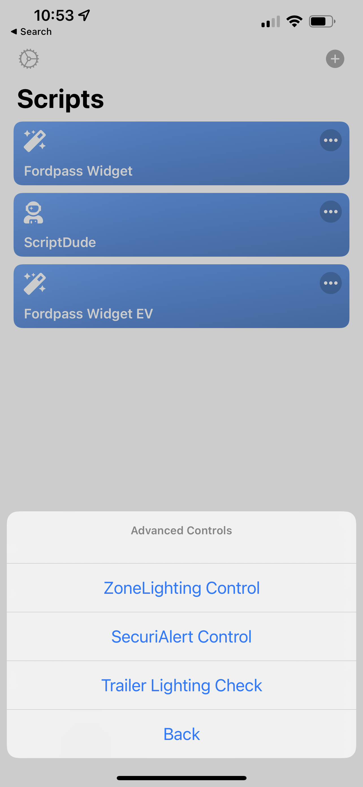
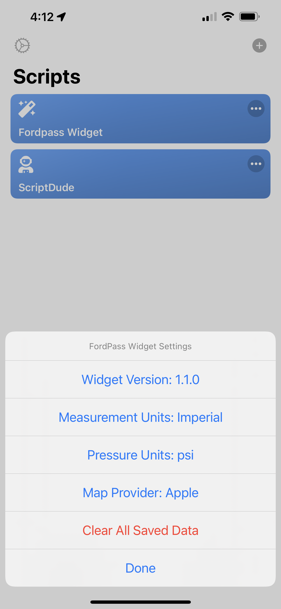

# FordPass widget for iOS Scriptable

## Intro

This widget is based off the work of  by David Schablowsky.
It's been significantly rewritten to add a new design, features, and much easier to maintain and improve.
It no longer requires editing the script file to configure options and login information.
This widget fetches information about your ford vehicle and displays them in a simple interactive widget.
The widget has been tested on my 2021 F-150 and another users 2020 Explorer, but should work on a majority of FordPass enabled devices (It doesn't support all electric features yet).

## Requirements

- iOS 14+
- [Scriptable App](https://scriptable.app/) (free)
- [FordPass account](https://sso.ci.ford.com/authsvc/mtfim/sps/authsvc?PolicyId=urn:ibm:security:authentication:asf:basicldapuser&Target=https%3A%2F%2Fsso.ci.ford.com%2Foidc%2Fendpoint%2Fdefault%2Fauthorize%3FqsId%3D1f0281db-c684-454a-8d31-0c0f297cc9ed%26client_id%3D880cf418-6345-4e3b-81cd-7b623309b571&identity_source_id=75d08ad1-510f-468a-b69b-5ebc34f773e3#appID=CCCA9FB8-B941-46AD-A89F-F9D9D699DD68&propertySpecificContentKey=brand_ford&originURL=https%3A%2F%2Fwww.ford.com%2F&lang=en_us&fsURL=https%3A%2F%2Fapi.mps.ford.com) (has to be working with FordPass app, and NOT MyFord Mobile)

## Features

- Will automatically fetch data from server (default every 5 minutes)
- Tapping on the Vehicle location in the widget will open Apple Maps (or Google Maps) pin the position of your vehicle.
- Tapping anywhere in the widget will open the scriptable app and provide a menu of quick actions for your vehicle
- Automatically pulls in you vehicle image and displays it in the widget.
  
  
  
   
  
 
  
## Todo

- Add customizable refresh intervals in the settings
- Get SecuriAlert control working.
- Widget code updater mechanism (I don't have a way to do this yet)
- Better support for electric vehicles (Don´t have one test with yet!!)

## Installation

### Automated Install

### Manual Install
- Browse here to [view the latest code](Fordpass%20Widget.js)
- Press "raw" in the upper left corner and copy everything after opening the [Fordpass Widget.js](Fordpass%20Widget.js) script
- Open Scriptable App
- Press on "+" in the upper right corner and paste the code
- Press "Done"
- Tap on the widget and a menu will appear for you to enter your login information and VIN number.
- Pressing "Done" will save the data and open another config page to allow you to change the settings.
- Go to your iOS homescreen and make a long press to enter "homescreen edit mode"
- Press "+" on the upper left corner and choose "Scriptable" as a medium sized widget
- Still in "wiggle mode" tap on the newly created widget and choose the FordPass Widget from the list under "Script"

For easy maintenance of the script I recommend just saving the Fordpass Widget.js file directly to the Scriptable folded inside the iCloud Drive it will make it easier to update it without having to copy and paste the code again. Any changes are reflected in the scriptable app.

## Notes
 
Sometimes the fuel data will be missing or incorrect. This is due to the fact that the fuel data is not always available in the Fordpass API.

## Troubleshooting and Debugging

The easiest way to edit the code and see the results in realtime is to use iCloud on your computer. On windows it requires installing the [iCloud Drive](https://www.icloud.com/drive/).

If you browse to the iCloud Drive folder look for the Scriptable folder and you will see all the scripts you have in the app.  Just edit the Fordpass Widget.js file and save it and within a few seconds it will be updated in the Scriptable app which you will need to tap the 3 dots on the widget in the app.  You have to exit the editor view in the scripable app after each external code change.
Then just hit the play symbol to run the code in the app.

## Credits

Thanks to [dschablowsky](https://github.com/dschablowsky/FordPassWidget) for his work on the original widget, [d4v3y0rk](https://github.com/d4v3y0rk) for finding out the information about the ford api. Additional thanks to [marco79cgn](https://github.com/marco79cgn) and [Tobias Battenberg](https://github.com/mountbatt) for your widgets. They inspired me to create my own widget!

## Disclaimer

I have created this widget in my freetime. I do NOT work for Ford nor do I get anything for creating this widget. The api used can be changed at any moment by Ford. Do not share this widget code with your login data embedded in it. I am NOT liable for any kind of damage (special, direct, indirect, consequential or whatsoever) resulting from the use of this widget/script. Anybody who is in possesion of your data can control your car.
