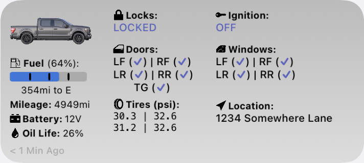
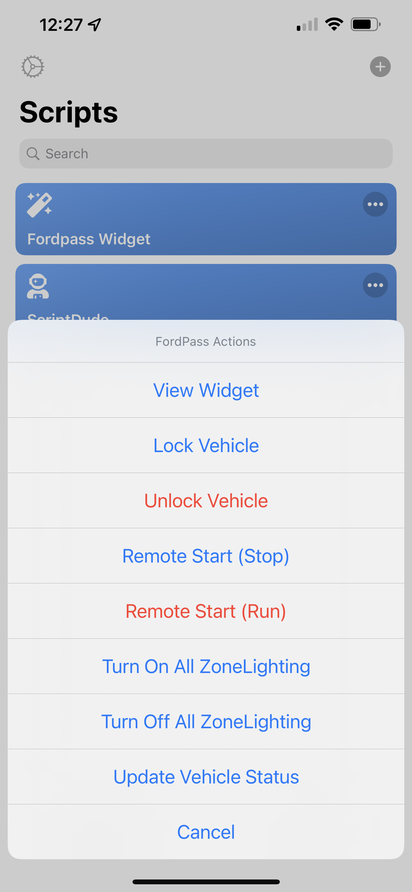

# FordPass widget for iOS Scriptable

## Intro

This widget is based off the work of  by David Schablowsky.
It's been significantly rewritten to add a new design, features, and much easier to maintain and improve.
This widget fetches information about your ford vehicle and displays them in a simple interactive widget.
The widget has been tested on my 2021 F-150 and another users 2020 Explorer, but should work on a majority of FordPass enabled devices (It doesn't support all electric features yet).

## Requirements

- iOS 14+
- [Scriptable App](https://scriptable.app/) (free)
- [FordPass account](https://sso.ci.ford.com/authsvc/mtfim/sps/authsvc?PolicyId=urn:ibm:security:authentication:asf:basicldapuser&Target=https%3A%2F%2Fsso.ci.ford.com%2Foidc%2Fendpoint%2Fdefault%2Fauthorize%3FqsId%3D1f0281db-c684-454a-8d31-0c0f297cc9ed%26client_id%3D880cf418-6345-4e3b-81cd-7b623309b571&identity_source_id=75d08ad1-510f-468a-b69b-5ebc34f773e3#appID=CCCA9FB8-B941-46AD-A89F-F9D9D699DD68&propertySpecificContentKey=brand_ford&originURL=https%3A%2F%2Fwww.ford.com%2F&lang=en_us&fsURL=https%3A%2F%2Fapi.mps.ford.com) (has to be working with FordPass app, and NOT MyFord Mobile)

## Features

- Will automatically fetch data from server (default every 5 minutes)
- Tapping on the Vehicle location in the widget will open Apple Maps (or Google Maps) pin the position of your vehicle.
- Tapping anywhere in the widget will open the scriptable app and provide a menu of quick actions for your vehicle.

  
  
## Todo

- Widget code updater mechanism (I don't have a way to do this yet)
- Better support for electric vehicles (Don´t have one test with yet!!)

## Installation

- Browse here to [view the latest code](Fordpass%20Widget.js)
- Press "raw" in the upper left corner and copy everything after opening the [Fordpass Widget.js](Fordpass%20Widget.js) script
- Open Scriptable App
- Press on "+" in the upper right corner and paste the code
- Insert your username, password of your Ford account and the VIN of your vehicle, edit the vehicle type (add your own if it's missing).
- Go to your iOS homescreen and make a long press to enter "homescreen edit mode"
- Press "+" on the upper left corner and choose "Scriptable" as a medium sized widget
- Still in "wiggle mode" tap on the newly created widget and choose the FordPass Widget from the list under "Script"

For easy maintenance of the script I recommend just saving the Fordpass Widget.js file directly to the Scriptable folded inside the iCloud Drive it will make it easier to update it without having to copy and paste the code again. Any changes are reflected in the scriptable app.

## Notes

Don´t set the refresh interval too low. Too much requests to the ford server can block you temporarily. Additionally the data stored on the ford server is only updated while the ignition is on. Therefore you´ll get the same old data until you turn on your car. Furthermore too much requests can slow down the servers performance and increase the chance that the api is changed.

Use `clearKeychainOnNextRun` and `clearFileManagerOnNextRun` only if you are having trouble with the script. If both parameters are true, the auth_token and pictures are fetched everytime the script is executed. Once everything is working again, set both to `false`.

## Credits

Thanks to [dschablowsky](https://github.com/dschablowsky/FordPassWidget) for his work on the original widget, [d4v3y0rk](https://github.com/d4v3y0rk) for finding out the information about the ford api. Additional thanks to [marco79cgn](https://github.com/marco79cgn) and [Tobias Battenberg](https://github.com/mountbatt) for your widgets. They inspired me to create my own widget!

## Disclaimer

I have created this widget in my freetime. I do NOT work for Ford nor do I get anything for creating this widget. The api used can be changed at any moment by Ford. Do not share this widget code with your login data embedded in it. I am NOT liable for any kind of damage (special, direct, indirect, consequential or whatsoever) resulting from the use of this widget/script. Anybody who is in possesion of your data can control your car.
